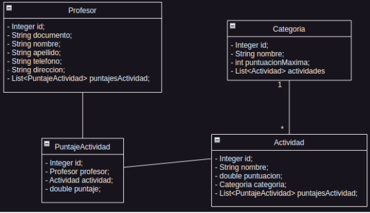
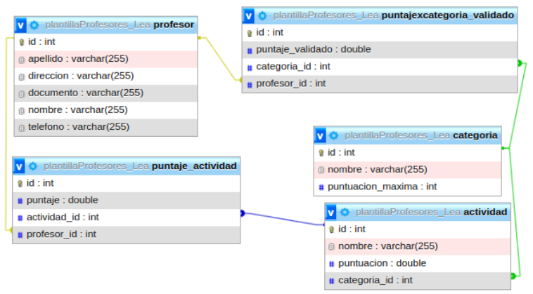
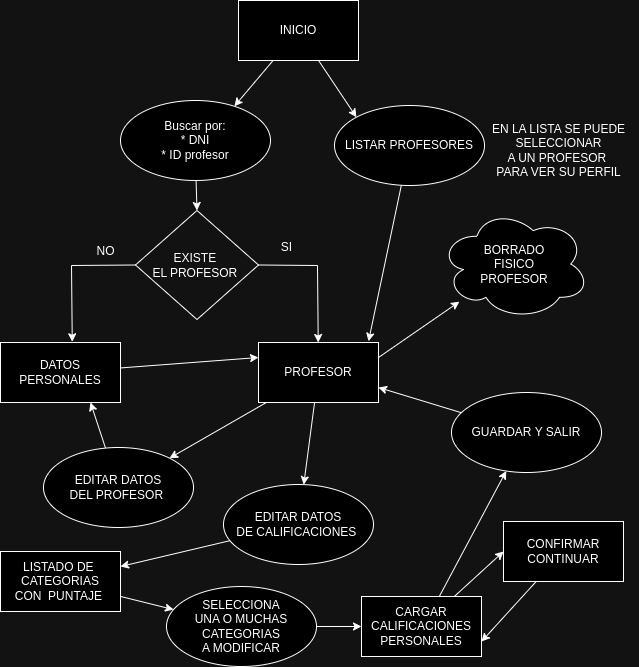

# Planilla de Ponderación de Profesores

## **Introducción**

Este proyecto está diseñado para la evaluación de los puntajes de profesores que están postulando a una institución. La evaluación se lleva a cabo a través de múltiples categorías, que a su vez están subdivididas en actividades. Cada actividad permite al entrevistador asignar un puntaje específico. Al sumar todos los puntajes de las actividades y luego los de las categorías, se obtiene un puntaje total para el profesor.

## **Requerimientos**

El proyecto debe incluir una página web que esté conectada a una base de datos. Además, debe permitir la visualización y gestión de diversas acciones tanto para el profesor como para la puntuación, incluyendo la capacidad de guardar, editar, eliminar y mostrar datos. También se requiere que el sistema realice validaciones, tales como no permitir la carga de duplicados en el DNI del profesor y respetar la puntuación máxima asignada para cada categoría.

## **Solución Propuesta**

El proyecto se ha desarrollado principalmente en **Java** versión 17 con **Maven**, utilizando **Spring Boot** como marco principal. Además, se han incorporado otros lenguajes y herramientas para diversas funcionalidades:

- **SQL**: Para la gestión y consultas necesarias que afectan a la base de datos.
- **HTML**: Con la ayuda de *Thymeleaf* para crear las vistas necesarias en la página web del proyecto.
- **JavaScript**: Implementado para la manipulación de las vistas, incluyendo validaciones y modificaciones de estilos.
- **CSS**: Junto con *Bootstrap*, se utilizó para estilizar las distintas páginas web del proyecto.

## **Arquitectura**

El sistema se basa en el patrón de arquitectura **MVC** (Modelo-Vista-Controlador), una estructura que separa claramente las responsabilidades y funciones en tres componentes principales:

### **Modelo (Model)**

- **Entidad**: La carpeta `entidad` alberga las clases que representan las entidades del modelo de datos. Estas clases pueden ser mapeadas directamente a tablas en la base de datos utilizando JPA (Java Persistence API).

- **JPA**: La carpeta `jpa` contiene clases y configuraciones relacionadas con JPA, facilitando la persistencia y manipulación de datos en la base de datos.

### **Vista (Templates)**

La interfaz de usuario se encuentra en la carpeta `templates`. Aquí, los archivos HTML y componentes como los del Nav y Footer (con el uso de Thymeleaf) y CSS definen la presentación visual que los usuarios finales experimentarán. El uso de Bootstrap proporciona una base sólida para el diseño y estilo de las páginas web, asegurando una interfaz de usuario atractiva.

### **Controlador (Controller)**

La lógica de control se organiza en la carpeta `controlador`. Aquí, las clases Java actúan como controladores, gestionando las solicitudes del usuario y coordinando la interacción entre el modelo y la vista.

### **Servicio (Service)**

La carpeta `servicio` contiene interfaces y clases que encapsulan la lógica de negocio de la aplicación. Estas clases pueden ser llamadas por los controladores para realizar operaciones específicas en el modelo.

## **Diagrama de Clases**

## **Diagrama Entidad Relación**

## **Diagrama de Flujo**

## **Mejoras Futuras**

Con el objetivo de potenciar aún más el proyecto, se proponen las siguientes mejoras:

### **Gestión de Usuarios y Acceso**

Se sugiere la creación de una nueva entidad para los usuarios responsables de la carga y calificación de datos de los profesores. Esto requerirá la implementación de un sistema de autenticación o login para garantizar el acceso seguro a la aplicación.

### **Auditoría de Datos**

Se propone agregar una funcionalidad de auditoría para registrar las acciones realizadas por los usuarios que manipulan la información. Esto proporcionará un registro detallado de las actividades realizadas, mejorando la transparencia y la trazabilidad de los datos.

### **Importación de Datos Externos**

Para agilizar la carga de datos, se plantea la implementación de una funcionalidad que permita leer datos desde archivos CSV o JSON. Estos datos podrían provenir de formularios externos, como los generados por Google Forms, facilitando aún más el proceso de carga de información.

### **Almacenamiento de Archivos**

Se sugiere incorporar una funcionalidad que permita a los usuarios subir archivos, como archivos PDF, y almacenarlos en la base de datos. Esto sería útil para almacenar pruebas o documentos relacionados con los profesores, mejorando la organización y accesibilidad de la información.
